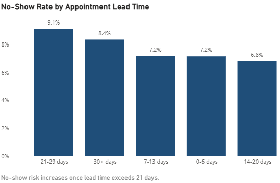
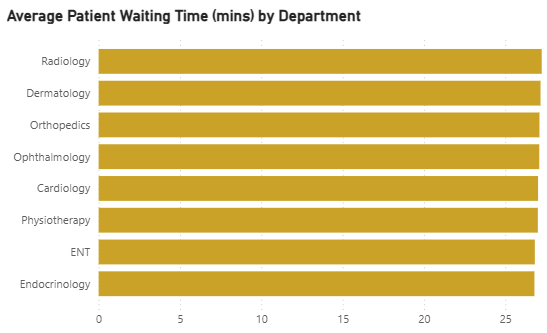

📌 Featured Project  
**Hospital Appointment Operations Analytics (SQL Server)**  
Analyzed 52k+ hospital appointments to identify no-show drivers, lead-time risks,
and clinic flow bottlenecks using T-SQL.

## Objective
Analyze appointment operations to improve utilisation, reduce no-shows, and shorten patient waiting time.

## Tech
- SQL Server (T-SQL)
- SSMS

## Data Model
Tables:
departments, clinicians, patients, referral_sources, slot_types,
appointment_slots, appointments, reminders

## KPI Definitions
- No-show rate (%) = NoShow / total scheduled
- Cancellation rate (%) = Cancelled / total scheduled
- Lead time (days) = slot_start - booked_at
- Waiting time (mins) = start_time - checkin_time

## Key Insights
- Overall no-show rate is ~8%, with meaningful variation by department.
- No-show risk increases sharply once appointment lead time exceeds 21 days.
- Reminder delivery alone does not significantly reduce no-shows without targeting.
- Cancellation rates (13–15%) exceed no-shows, indicating rescheduling pressure.
- Average waiting time is ~27 minutes, suggesting system-wide flow constraints.

## 📊 Power BI Dashboard

### Overview

This dashboard provides a high-level view of appointment volume,
no-show risk, and clinic waiting times across departments.

### No-Show Rate by Department

No-show rates vary by department, with Ophthalmology and Physiotherapy
showing the highest risk.

### No-Show Rate by Appointment Lead Time

No-show risk increases noticeably once appointment lead time exceeds
approximately 21 days.

### Average Patient Waiting Time

Average waiting time is consistently around 27 minutes across departments,
indicating system-wide flow constraints.

## Files
- schema.sql: table definitions
- seed.sql: generates synthetic data (~52k appointments)
- queries.sql: analytics queries
- insights.md: findings and recommendations
